# Part 1

Скачал образ Ubuntu Server 22.04 LTS, и поставил на вертуальную машину

* Сразу после логина в пользователя делаю обновление системы и установка необходимых пакетов

        sudo apt-get update
        sudo apt-get upgrade
        sudo apt install make
        sudo apt install gcc
      
* Для установки gitlab-runner

`curl -L "https://packages.gitlab.com/install/repositories/runner/gitlab-runner/script.deb.sh"|sudo bash`

`sudo apt-get install gitlab-runner`
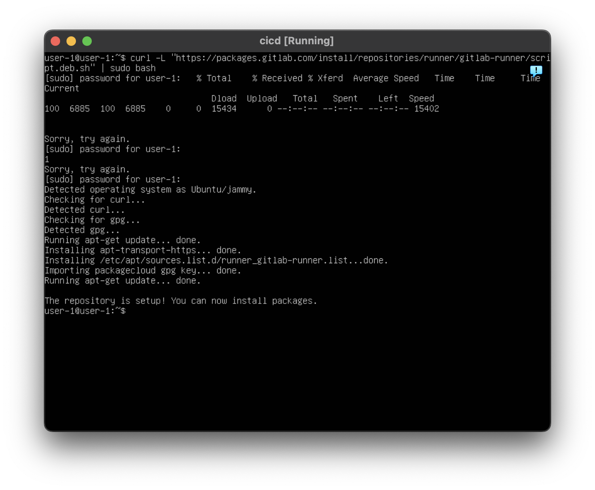

        sudo gitlab-runner start
        sudo gitlab-runner register

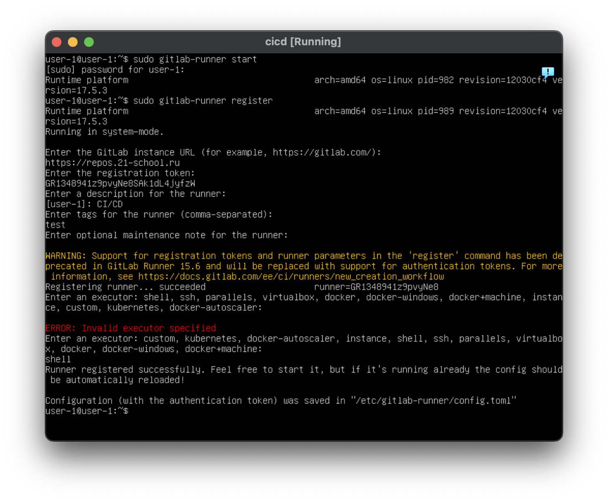

# Part 2

* Создать файл .gitlab-ci.yml можно ручками, можно получить новый комит с этим файлом в самом GitLab
    * Переписал файл для создания pipeline's, который тестирует сборку
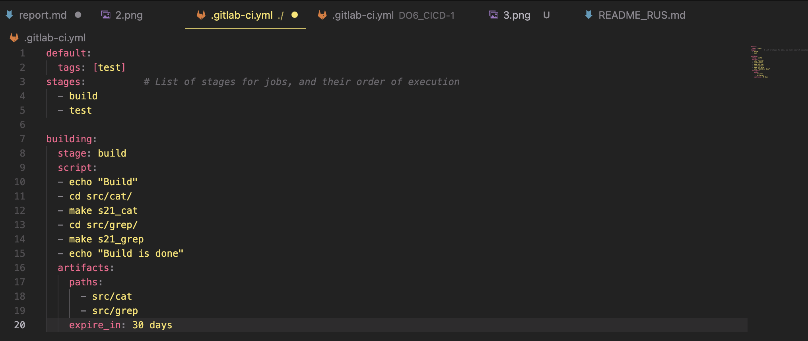

* Все собралось через make `Job's is succeeded`
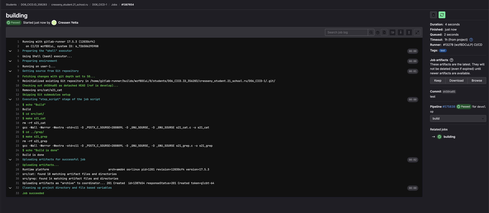

# Part 3

* Теперь требуется написать job's на code-style
    * Потребуется установиьб на машину clang-format
        * `sudo apt install clang-format`

* Дописываю файл .gitlab-ci.yml, так чтоб после пуша, запустился pipeline который провери на сборку и codestyle

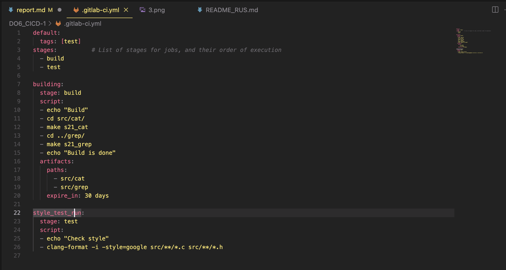

* Успешно

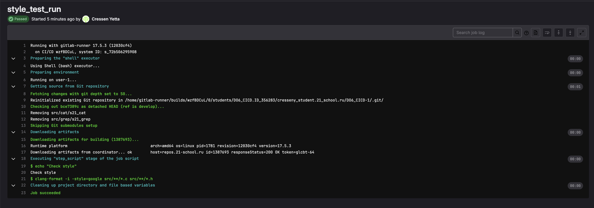
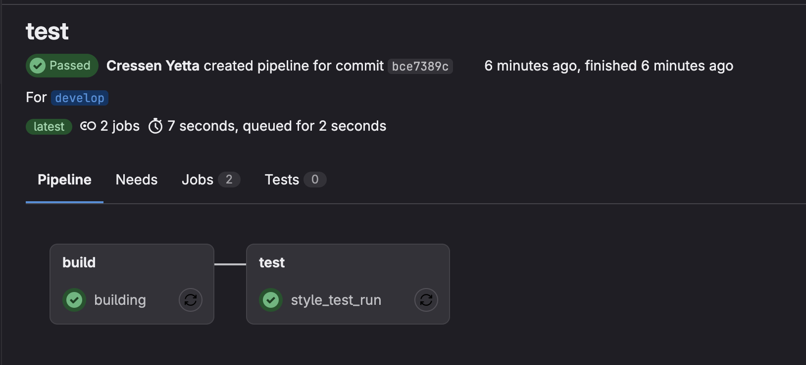

# Part 4

* Потребовалось создать 56 pipeline's, что бы исправить все ошибки в тестах

* добавил еще одну стадию, и добавленно условие при котором, если тесты не имеют fail's, то pipeline зафейлится

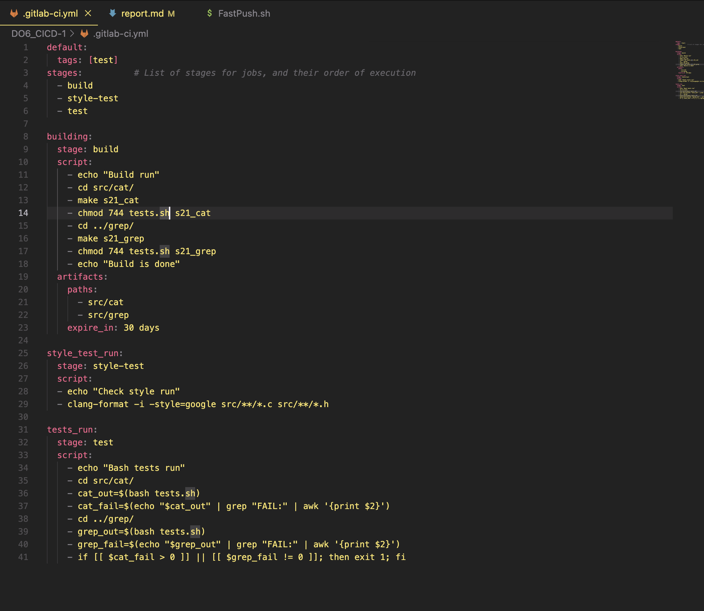

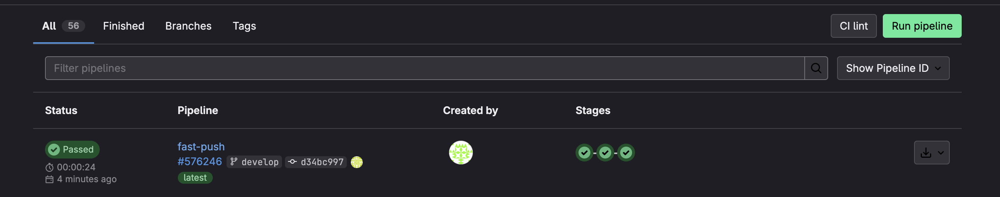

# Part 5

* Вернемся к Linux_Network, по знакомой схеме прокладываем статические маршруты до обеих машин через

`sudo vim /etc/netplan/*.yaml`

* Так же не забываем изменить настройки сети в настойках машины, добавть новый адаптер, поставить локальную сеть

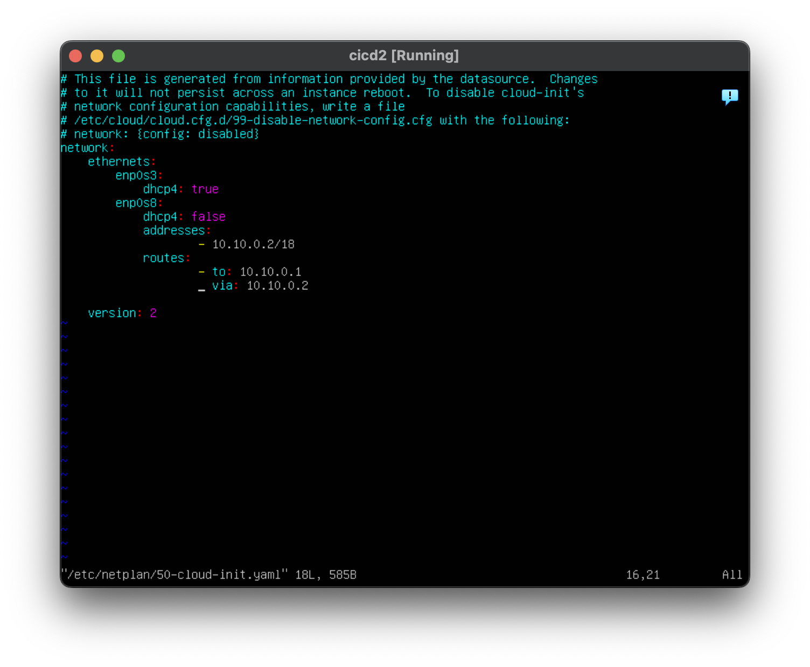

* После КАЖОГО изменения в netplan нужно ввести команду
`sudo netplan apply`

* По завершению этих действеий машины будут пинговаться по локалке

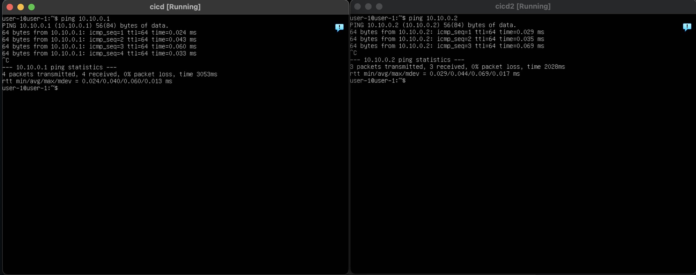

* Далее нужно дописать конфиг .gitlab-ci.yml для стадии deploy

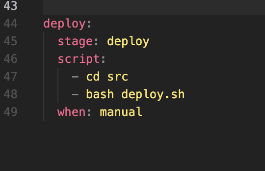

* pipeline is done 

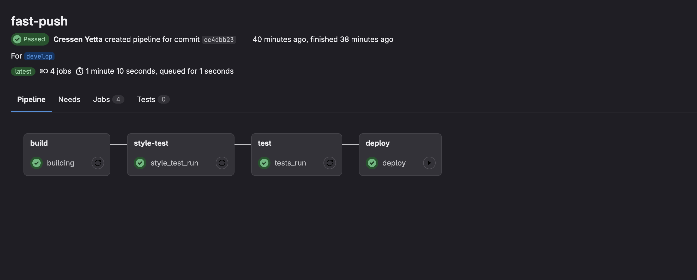

* После успешной CI части, запкскается deploy, который копирует артифакты, на машину

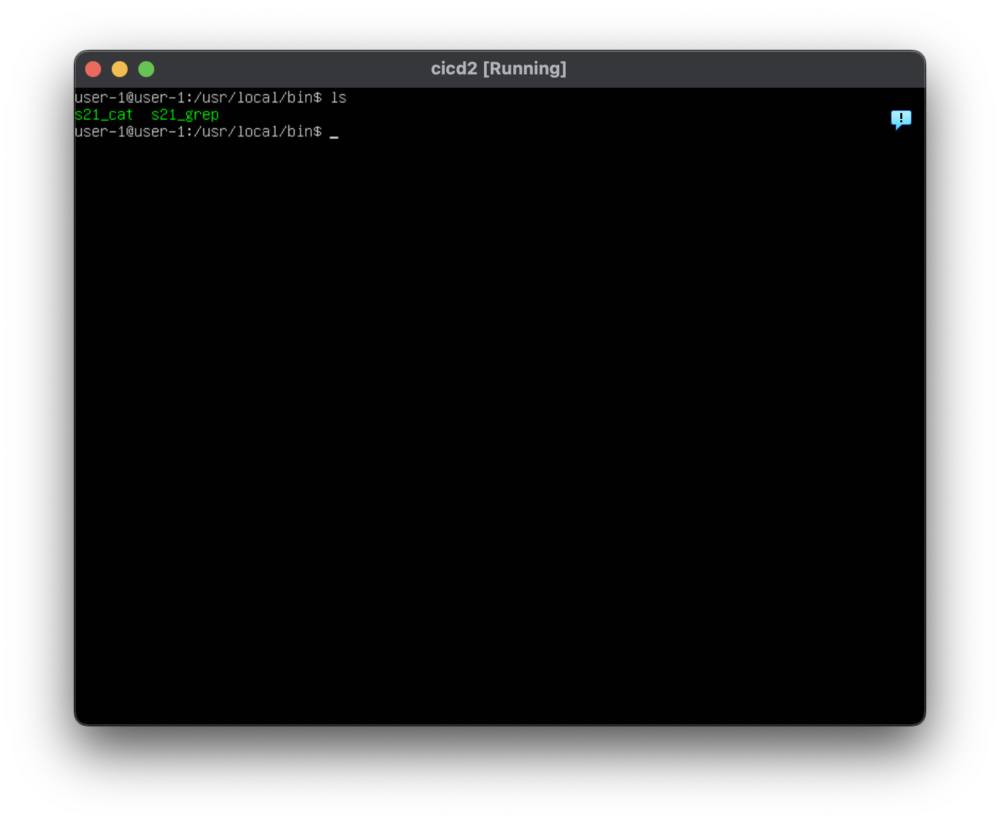

# Part 6

* Тут нужно подключить оповещения в тг боте, заходим в BotFather, следуем инструкциям, получаем токен

* Так же нужно получить id чата, для того чтобы бот мог отправлять сообщения о завершении jobs
  * Чтобы получить id чата заходим на сайт `https://api.telegram.org/bot$TELEGRAM_BOT_TOKEN/getUpdates` и отправляем сообшение в своего бота, после нужно обновить станицу. После обновления в сторках будет id чата, копируем его.

* Еще нам потребуется скрипт или же запрос, в этом скрипте есть 2 переменые, это токен и id чата, вставляем туда свои параметры.

`Скрины со токинами из-за сообрадений безопасности выкладывать не буду`

* Теперь нужно дописать .gitlab-ci.yml, чтоб скрипт запускался на каждой стадии

* Комитим, и поверяем тг бота

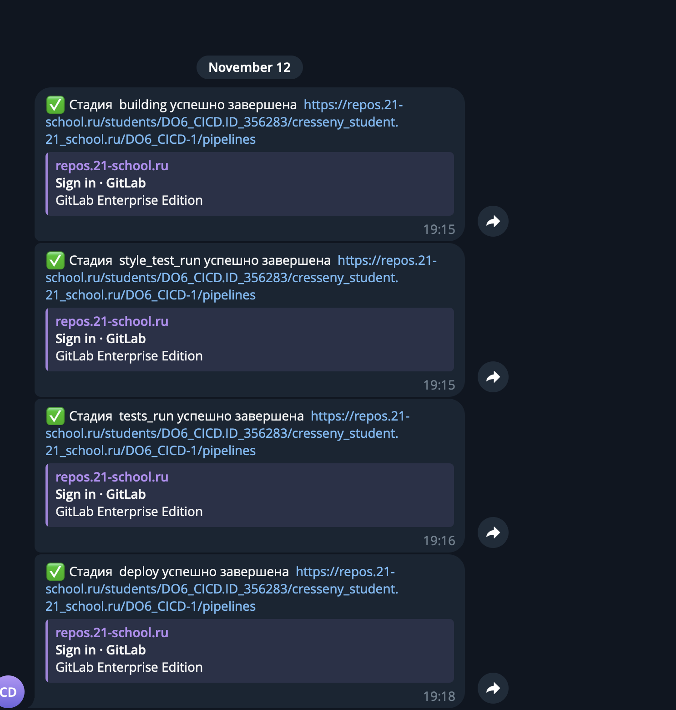